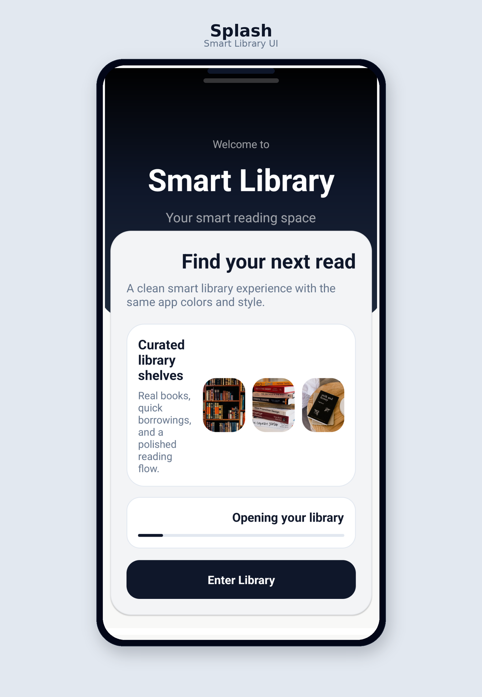
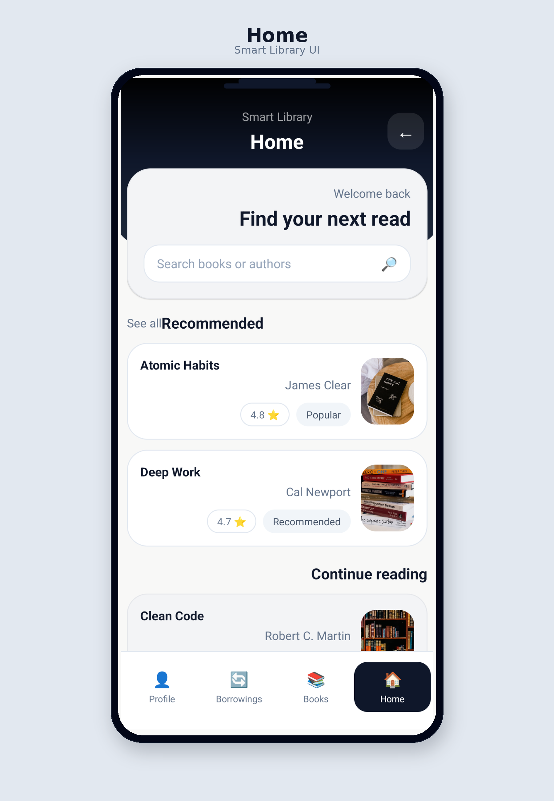
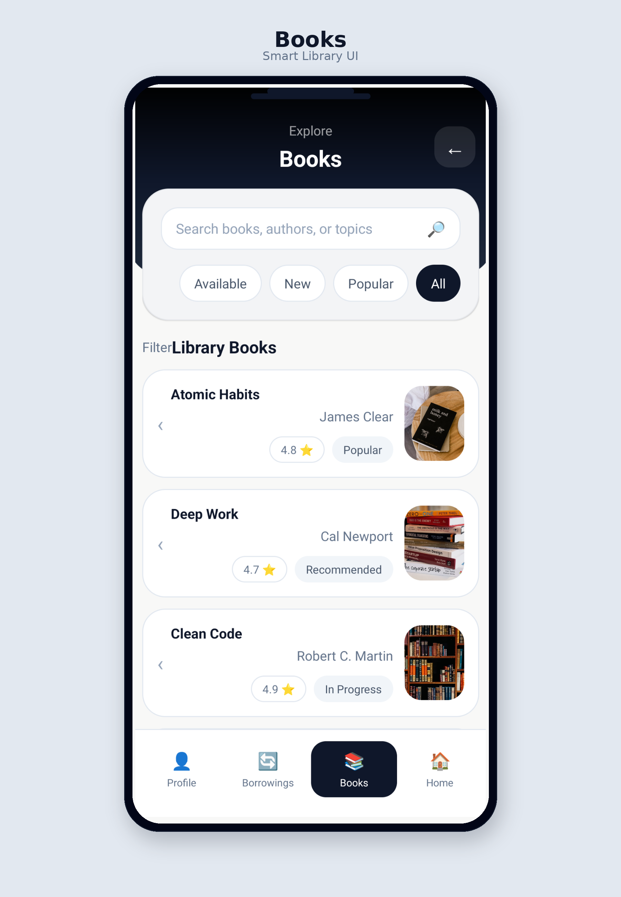
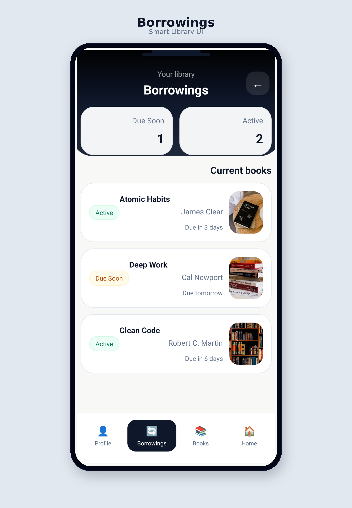
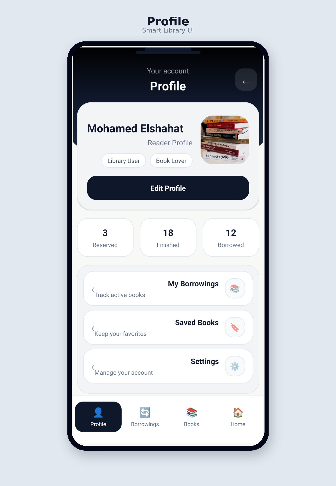

# Smart Library

Smart Library is a modern Android UI project for a smart library application.

The project is designed to provide a clean and organized experience for users who want to explore books, manage their borrowings, and access their profile through a simple and visually clear interface.

## Project Overview

The main goal of this project is to build a mobile library app with a consistent design system and an easy user flow.

The app focuses on:
- exploring books in a simple way
- tracking borrowed books and due dates
- presenting profile information clearly
- keeping the interface modern, clean, and easy to navigate

## Main Screens

- **Splash**  
  A simple opening screen that introduces the app.

- **Home**  
  Includes a welcome section, search bar, recommended books, and a continue reading section.

- **Books**  
  Displays the library collection with search, filters, and book cards.

- **Borrowings**  
  Shows current borrowed books, due dates, and borrowing status.

- **Profile**  
  Presents user information, reading stats, and quick actions.

## Features

- Clean and modern Android UI
- Organized navigation between main screens
- Dark top header with a light content area
- Soft gray cards and rounded corners
- Book search and category filters
- Borrowing tracking with due status
- Profile screen with user details and quick actions
- Realistic book cover images
- Consistent layout and spacing across screens

## Tech Stack

- **Kotlin**
- **Android XML**
- **Fragments**

## Design Style

The design is based on a simple and clear visual system that includes:
- dark header sections
- light background
- soft gray surfaces
- rounded cards
- balanced spacing
- easy-to-read content
- clean bottom navigation

## Preview

### Splash

  

### App Screens

  
  

  
  

## Author

**Mohamed Elshahat**
